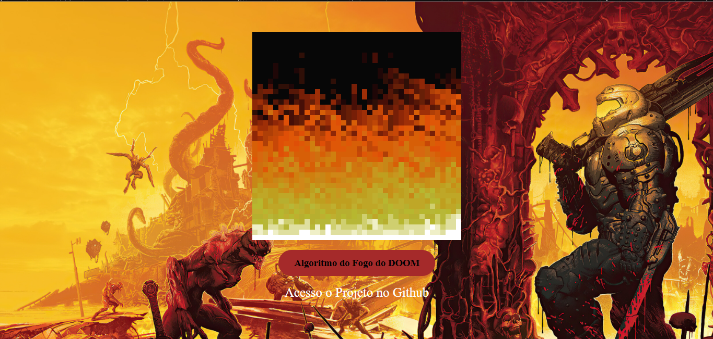

# Algoritmo-Do-Fogo-do-DOOM 🔥
<h5>Detalhes a se destacar no projeto</h5>

<ul>
     <li>Projeto com base na criação e manipulação de Arrays</li>
     <li>Foi utilizado laços for para trabalhar com os dados do Array</li>
     <li>O código tem 3 partes  a estrutura de dados, o cálculo da intensidade de fogo e a renderização</li>
</ul>

